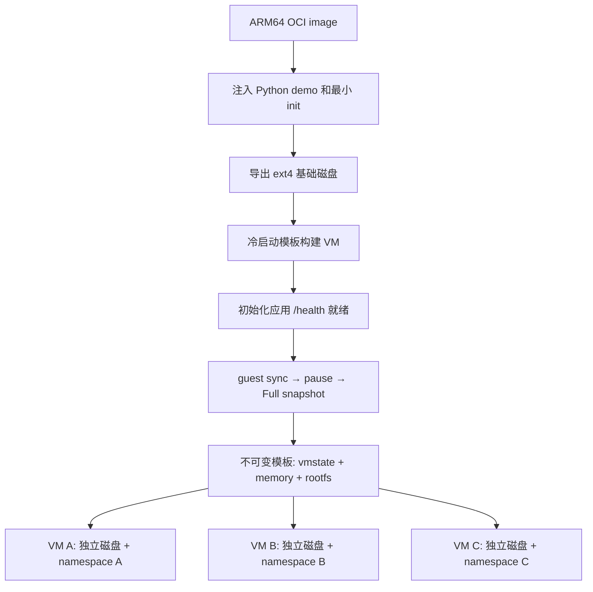

# 单机 aarch64 microVM 模板与热启动实验

这套实验实现三个目标：用 Firecracker 启动 microVM；从 OCI 镜像构建可恢复模板；从同一模板热启动多个独立 VM。所有源码、配置、测试、运行产物均放在 `microVM/` 下。

**验证状态：本地 macOS 已执行 Python 单元/通信测试和 shell 语法检查；尚未在目标 aarch64/KVM 服务器运行。下面的步骤是服务器上的完整验收流程，文中的性能数字不是实测结果。**

## 1. 实验范围与设计

| 项目 | 本实验 |
|---|---|
| Host | 一台 Linux aarch64 服务器，KVM 可用；依赖安装示例使用 Ubuntu 24.04 |
| VMM | 固定 Firecracker **v1.12.1**，使用该版本的 ARM64 API；这是复现实验版本，不是最新版本声明 |
| Guest kernel | 下载 Firecracker v1.12 CI 的 aarch64 Linux 6.1 Image，下载结果 URL/SHA256 留档 |
| fromImage | 默认 `ubuntu:24.04`，可替换为含 apt/dpkg 的兼容 ARM64 镜像 |
| 构建 | Docker 构建/导出用户空间 → ext4 → 真正启动 Firecracker VM → 应用就绪 → 快照 |
| 热启动 | Firecracker `snapshot/load`，`File` 内存后端，随后 `Resumed` |
| 内存 | 原生文件映射、按需缺页、写时复制；模板 memory 保持不可变 |
| 磁盘 | 每实例独立 rootfs 文件；支持 reflink 时用 CoW，否则明确回退到 sparse/full copy |
| 网络 | 每 VM 一个 namespace，其中都有独立 `tap0`；相同 guest IP/MAC 不跨 namespace 冲突 |
| 应用 | Python HTTP 服务，完成可调的内存预加载和模拟初始化后开始监听 |
| 配置 | 默认 1 vCPU、512 MiB RAM、1536 MiB rootfs；并发示例 3 个实例 |

建议为默认实验准备至少 4 GiB 可用 RAM、15 GiB 可用磁盘；多轮 benchmark 会保留每次的磁盘和日志，所需空间随轮数增长。磁盘不支持 reflink 时，应按完整副本保守估算空间。实际可启动数量由宿主机可用资源决定。



### 与 E2B 的对应关系

| E2B 概念 | 实验对应实现 | 简化部分 |
|---|---|---|
| fromImage | `scripts/from-image.sh` + `guest/Dockerfile` | 依赖 Docker 导出 OCI，不实现自有镜像层解包器 |
| provisioning/envd | 最小 PID 1 init + Python 管理/演示服务 | 不安装完整 systemd/envd |
| StartCmd/ReadyCmd | agent 的初始化逻辑 + `/health` | 当前是固定示例应用，不实现通用命令 DSL |
| 模板快照 | `snapshot/vmstate`、`memory`、`rootfs.ext4` | Full snapshot；无 E2B 层差分/缓存索引 |
| 内存懒加载 | Firecracker File backend | 无远程块存储、自定义 UFFD 服务 |
| 磁盘隔离 | reflink 或独立复制 | 无 NBD/自定义块层 |
| 多实例调度 | 单机线程池 | 无多节点调度、在线 VM 资源池 |

这里的热启动指**从完成初始化的 VM 状态恢复**，不是维持 N 台空闲 VM。File 后端已经能验证按需加载和内存 CoW；完整实现 E2B 的 UFFD/远程块存储应作为后续实验。

## 2. 文件说明

```text
microVM/
├── README.md
├── template.example.json       # from_image、CPU/RAM、磁盘、初始化参数
├── lab.py                      # build/start/health/verify/bench/stop
├── scripts/
│   ├── fetch-assets.py         # 固定版本 VMM + ARM guest kernel
│   └── from-image.sh           # OCI → ext4
├── guest/
│   ├── Dockerfile              # 向基础镜像注入实验运行环境
│   ├── init.sh                 # mount、网络、exec Python PID 1
│   └── agent.py                # 预热、探针、实例身份、读写隔离验证
├── tests/test_lab.py           # 无需 KVM 的本地测试
└── artifacts/                  # 运行时自动生成，git 忽略
    ├── assets/                 # VMM、Image、来源和 SHA256
    ├── templates/<name>/       # 配置、镜像 inspect、构建日志、模板
    ├── instances/<id>/         # 私有磁盘、API socket、日志、状态/计时
    └── reports/               # launch / benchmark / verify JSON
```

`guest-config.json` 在构建时从模板配置生成到临时 Docker context，无需手动创建。

## 3. 准备服务器

将整个目录复制到服务器，例如：

```bash
# 本地执行，替换用户名和服务器地址
scp -r microVM user@server:~/microVM

# 后续命令均在服务器上执行
cd ~/microVM
uname -m
ls -l /dev/kvm /dev/net/tun
```

`uname -m` 必须是 `aarch64`。不要使用 macOS Docker Desktop 来代替这台 KVM 服务器。目录绝对路径应较短，例如 `/home/user/microVM`；Unix socket 路径有长度限制，脚本会检查。

Ubuntu 24.04 上安装依赖（已有 Docker 的服务器跳过 `docker.io` 安装）：

```bash
sudo apt-get update
sudo apt-get install -y python3 curl iproute2 e2fsprogs util-linux tar coreutils docker.io
sudo systemctl enable --now docker
sudo modprobe tun
```

构建期间服务器需要访问 GitHub、Firecracker CI S3、OCI registry 和 apt 仓库。依赖安装全部发生在 Docker 构建阶段；运行中的 guest 默认不访问互联网。

下载固定版本的 Firecracker 及 guest kernel：

```bash
python3 scripts/fetch-assets.py
sudo python3 lab.py doctor
```

下载器固定 VMM 版本为 v1.12.1，在其 CI 目录选择可用的最高 6.1 patch kernel。第一次下载后，`assets.json` 保存具体 URL 和 SHA256，后续保留这套文件复现，不会每次构建重新选 kernel。可用 `--kernel-url` 固定具体 URL，或提供 `--kernel-sha256` / `--archive-sha256` 校验预先掌握的摘要；自动记录摘要本身不等同于独立签名校验。

如果旧 CI bucket 不再提供文件：使用你保存的资产，或从 Firecracker 对应版本提供的 ARM guest kernel config 构建 Linux 6.1，将 `arch/arm64/boot/Image` 放在 `artifacts/assets/Image`，并将 v1.12.1 aarch64 binary 放在 `artifacts/assets/firecracker`。需要内建 virtio-mmio、virtio-blk、virtio-net、virtio-rng、ext4、devtmpfs 和串口支持。ARM 使用未压缩的 **Image**；下载对象即使叫 `vmlinux-6.1.x`，也必须是 ARM kernel 格式，不能拿 x86 ELF vmlinux 代替。

`doctor` 检查架构、依赖、VMM 版本、`/dev/net/tun`，并实际调用 KVM_GET_API_VERSION / KVM_CREATE_VM。基本检查通过仍不等于完整 ARM CPU/GIC 与 Firecracker 兼容，最终以真实启动验收为准。

## 4. 实验 A：fromImage 创建模板，并验证冷启动

配置文件：

```json
{
  "name": "python-demo",
  "from_image": "ubuntu:24.04",
  "vcpus": 1,
  "memory_mib": 512,
  "rootfs_mib": 1536,
  "warmup_seconds": 3,
  "warmup_mib": 64
}
```

运行：

```bash
sudo python3 lab.py build template.example.json
sudo python3 lab.py start python-demo --mode cold --id cold-one
sudo python3 lab.py health cold-one
sudo python3 lab.py stop --id cold-one
```

构建会执行以下动作：

1. 拉取 ARM64 基础镜像并记录 image inspect，包括实际镜像 ID/digest 信息。
2. 在 Docker 中安装 Python 和运行依赖，注入 init 和 agent。
3. `docker create` + `docker export`，保留文件属主和权限，`mkfs.ext4 -d` 生成 rootfs。
4. 为 builder 复制独立 rootfs，创建 namespace/TAP，启动 Firecracker。
5. 设置 machine-config、boot-source、drive、NIC 和 entropy 设备，调用 InstanceStart。
6. Guest 初始化：分配并触碰 64 MiB 数据，计算摘要，模拟等待 3 秒，启动 HTTP 服务。
7. 调用 `/prepare-snapshot` 进行 guest `sync`，暂停 VM，保存 Full snapshot。
8. 终止暂停的 builder 后复制匹配的磁盘；模板文件设为只读，最后写入 `template.json` 作为成功标记。

构建日志：`artifacts/templates/python-demo/from-image.log`。Firecracker/内核日志位于 builder 实例的 `console.log`。

模板目录中的 `rootfs.ext4` 是冷启动基线；`snapshot/rootfs.ext4` 是与快照内存匹配的磁盘。**热启动必须使用后者，不能把原始基础磁盘与已运行过的内存快照混用。**

`build` 拒绝覆盖已有同名模板。修改配置或 guest 代码后使用新模板名，例如 `python-demo-v2`，避免覆盖正在给其他实例提供内存页的快照。

验收：`health cold-one` 返回 `ready: true`，可见 `boot_token`、初始化耗时、`instance_id: cold-one`。该冷启动实例的 `boot_token` 应与模板中的不同，因为它执行了新的应用初始化。

## 5. 实验 B：从同一个快照并发热启动多个 VM

```bash
sudo python3 lab.py start python-demo --mode warm --count 3 --parallel 3
sudo python3 lab.py list
```

记录输出的实例 ID，例如 `warm-xxxxxxxxxx`，查询任意一个：

```bash
sudo python3 lab.py health warm-xxxxxxxxxx
```

恢复顺序：

```text
独立 rootfs 副本
→ 独立 namespace 内创建 tap0
→ 新的 Firecracker 进程
→ PUT /snapshot/load (File backend, resume_vm=false)
→ PATCH /vm {state: Resumed}
→ /health
→ /init 注入实例 ID、host 时间和演示应用随机种子
```

恢复时不调用 InstanceStart，不重新配置 CPU/RAM/boot-source。CPU 和内存尺寸来自模板快照；需要改变它们时重新构建模板。

磁盘路径在 Firecracker 配置中固定为**相对路径 `rootfs.ext4`**，每个 VMM 的 cwd 指向自己的实例目录。因此从快照恢复同一个 drive 路径时，打开的是当前实例的私有磁盘，而不是 builder 或另一个实例的磁盘。不能把这一路径改为构建实例的绝对路径。

网络结构：

```text
namespace mvl-AAAA                 namespace mvl-BBBB
  tap0 172.30.0.1                    tap0 172.30.0.1
       ↕                                 ↕
  VM A eth0 172.30.0.2               VM B eth0 172.30.0.2
```

各 namespace 内保持同样的 host TAP MAC 和 guest MAC，并使用固定邻居项，使快照中的网络状态可继续使用。默认只允许在各 namespace 内访问 guest；不修改宿主机默认路由、iptables、IP forwarding，也不配置公网服务。`lab.py health` 内部用 `ip netns exec ... curl` 访问。

验收：多个 Firecracker 进程同时运行；各有独立实例目录、磁盘 inode、namespace。所有热启动实例的 `boot_token` 和 `initialized_at` 与模板一致，而 `instance_id` 各不相同。

## 6. 实验 C：验证内存、磁盘和模板不可变性

至少保留两个热启动实例后执行：

```bash
sudo python3 lab.py verify python-demo
```

脚本会真实读写运行中的 VM：

1. 检查所有热实例保留快照前的初始化 token/时间，且身份各不相同。
2. 在 A 中增加**内存计数器**，写入其 `/var/lib/microvm/marker` 并 sync。
3. 确认 B 的内存计数器和磁盘 marker 均未改变。
4. 检查各实例 rootfs 的 inode 不同。
5. 再恢复一个临时 VM，确认它仍得到模板原始计数器和磁盘内容。
6. 比对模板 vmstate、memory、rootfs 的 SHA256，确认源模板未被修改。

成功时输出 `passed: true`，结果保存在 `artifacts/reports/verify-*.json`。脚本会保留 A 中的验证写入；临时探针 VM 会停止。可以重复执行。该验收验证实验中的数据隔离，不是完整的恶意 guest 安全测试。

## 7. 实验 D：测量冷启动与热启动

先停止并发演示实例，避免负载干扰：

```bash
sudo python3 lab.py stop --all
sudo python3 lab.py bench python-demo --rounds 5
```

每轮各运行一次 cold、warm，下一轮反转顺序。单次测量结束后停止实例，保留日志和磁盘。结果记录每个样本以及 p50/p95/min/max。5 轮用于快速观察，p95 在这样的小样本中接近最大值；严肃统计应增加轮数并记录负载和缓存条件。

| 字段 | 测量范围 |
|---|---|
| `disk_mode` | `reflink` 或 `copy`，实际使用的磁盘准备方式 |
| `disk_prepare_ms` | 实例目录准备及磁盘副本创建 |
| `network_prepare_ms` | namespace、TAP、邻居项准备 |
| `api_ready_ms` | Firecracker 进程启动到 API 可调用 |
| `boot_or_restore_api_ms` | 配置并 InstanceStart，或 snapshot/load + resume 的 API 耗时 |
| `guest_ready_ms` | 上述 API 返回到 `/health` 成功 |
| `instance_init_ms` | 恢复后的实例身份/时钟初始化请求 |
| `vmm_to_ready_ms` | VMM 启动到 guest 就绪；不含磁盘和网络准备 |
| `total_ms` | 单个实例从准备资源到 `/init` 完成的端到端耗时 |
| `batch_wall_ms` | `start --count` 整批请求完成耗时，包含线程池排队 |

注意测量含义：

- `warmup_seconds: 3` 是**人为模拟的应用初始化延迟**，用于清楚展示快照跳过初始化的效果；由此得到的加速比不等于 Firecracker 自身恢复性能。
- 再复制配置，把 name 改为 `python-no-delay`、`warmup_seconds` 改为 0，重新构建并运行 bench，可以观察没有人为等待时的差异。
- cold 也使用已经做好的 OCI rootfs，测量不包含 Docker pull/build；warm 使用已完成应用初始化的匹配磁盘。
- 不自动清理全机 page cache，不假定 warm 样本必然是热页缓存；JSON 标明缓存条件未控制。镜像复制、刚完成构建、前几轮读取都会影响结果。
- File 后端将部分内存读取推迟到缺页时；`/health` 就绪不意味着全部内存都已驻留。真实业务首请求还应单独测量。
- ext4 不支持 reflink 时会回退复制，`disk_prepare_ms` 可能成为主要开销。只报 snapshot/load 的时间会掩盖这个问题。
- 本实验逐次建立网络资源，未实现 E2B 的网络预建池；所有控制请求还包含 Python/curl/ip 子进程开销，不能直接拿结果比较 E2B 对外启动指标。

## 8. 停止、清理与错误定位

```bash
sudo python3 lab.py stop --id warm-xxxxxxxxxx
sudo python3 lab.py stop --all
sudo python3 lab.py list
```

`stop` 只终止本实验记录且 PID 起始时间匹配的进程，再删除记录中的 namespace；不使用 `pkill firecracker`。实例日志和磁盘保留。需要释放空间时，先确认相关 VM 已停止，再手动删除 `artifacts/instances/` 下对应实例目录；正在运行的实例引用的模板 memory 文件不能删除或覆盖。仅停止实例还不会释放保留的磁盘文件。

| 现象 | 排查 |
|---|---|
| KVM ioctl 失败 | 检查 host KVM/ARM 虚拟化能力及权限；嵌套虚拟化环境需要实际向 guest 暴露 KVM |
| fromImage 构建失败 | 查看 `from-image.log`；镜像必须是 ARM64 且适配 apt/dpkg，Docker 必须能访问源 |
| rootfs 无空间 | 提高 `rootfs_mib` 并使用新模板名；检查构建临时目录空间 |
| kernel 格式或启动失败 | 检查 `console.log`、ARM Image 格式、virtio/ext4/串口驱动 |
| 超时且看不到 `/health` | 检查 init 日志、内存预算和 Python 异常；确认 guest eth0 已配置 |
| snapshot/load 失败 | 同一服务器、同一模板自带的 FC binary、匹配的 memory/vmstate/rootfs、实例 cwd 和 tap0 |
| ARM GIC/CPU 兼容错误 | 本实验不跨主机恢复；重启/升级 host 后若兼容性变化应重建模板 |
| 启动慢 | 看 `disk_mode`、各阶段耗时、page cache、宿主机剩余内存/CPU、并发数量 |
| API socket 路径过长 | 将整个目录复制到较短绝对路径，重新构建 |
| 构建中断 | 未写入 `template.json` 的目录不是可用模板；停止关联实例，用新模板名重试 |

异常退出后先运行 `stop --all`。若系统突然断电或控制程序在资源登记前被强制杀死，检查 `ip netns list` 中的 `mvl-` 资源与 `instances/*/instance.json`，核实归属后手动处理，不批量删除其他项目网络资源。

这是受信任镜像和 guest 的功能实验：VMM 以 root 运行、未启用 jailer/cgroup 配额，演示 API 也没有认证。快照复制会复制应用状态，本实验只为 demo 注入新身份、时间和 Python 随机种子，并未处理所有 guest 内核/用户程序的随机数和密钥状态；它不构成生产多租户沙箱。

## 9. 本地验证与参考资料

无需 Linux/KVM 的本地检查：

```bash
python3 -m unittest discover -s tests -v
bash -n scripts/from-image.sh guest/init.sh
python3 lab.py --help
python3 scripts/fetch-assets.py --help
```

测试覆盖 Unix socket HTTP 成功/失败、guest HTTP 读写、配置边界和避免 PID 复用误杀。它们不能替代实验 A/B/C 的真实 KVM 验收。

Firecracker 一手资料（实现固定到 v1.12.1）：

- [Getting started](https://github.com/firecracker-microvm/firecracker/blob/v1.12.1/docs/getting-started.md)：VMM/guest kernel 获取与启动 API。
- [Snapshot support](https://github.com/firecracker-microvm/firecracker/blob/v1.12.1/docs/snapshotting/snapshot-support.md)：快照、File 后端、文件生命周期、相对路径、ARM GIC 限制。
- [API schema](https://github.com/firecracker-microvm/firecracker/blob/v1.12.1/src/firecracker/swagger/firecracker.yaml)：使用的 machine-config、drive、network 和 snapshot 字段。
- [ARM kernel 格式](https://github.com/firecracker-microvm/firecracker/blob/main/docs/rootfs-and-kernel-setup.md)：aarch64 Image 与内核配置。

本地 E2B 代码对应位置（相对本目录）：

- [模板构建总入口](../runtime/packages/orchestrator/internal/template/build/builder.go)
- [OCI 到 rootfs](../runtime/packages/orchestrator/internal/template/build/core/rootfs/rootfs.go)
- [最终启动/就绪阶段](../runtime/packages/orchestrator/internal/template/build/phases/finalize/builder.go)
- [sandbox 恢复](../runtime/packages/orchestrator/internal/sandbox/sandbox.go)
